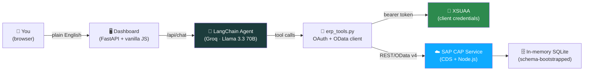

# 🧾 ERP Agentic AI Assistant

An agent that doesn't just *talk about* doing things — it does them, against a real, deployed SAP backend, with a safety net that doesn't depend on the AI being right 100% of the time.

[](https://erp-agentic-ai-assistant.onrender.com)


*First load on the live demo may take ~30s (free-tier hosting wakes from sleep). Usage is rate-limited to keep the shared AI quota fair for every visitor.*


---

## Why this project is different

Most "AI agent" demos stop at a mock REST API. This one doesn't:

- The backend is a **real SAP CAP (Cloud Application Programming Model) service**, written in CDS + Node.js, deployed to **SAP BTP Cloud Foundry**, with a real data model, custom business actions, and validation logic.
- Authentication is **real OAuth2 client-credentials via XSUAA** — the agent fetches and caches its own bearer token, the same way a production service-to-service integration would.
- Every write action (approve, reject, edit) is **staged, not executed** — the LLM can *propose* a change, but the actual mutation only happens from deterministic Python code, after an explicit "yes." The model's word is never trusted with real data.
- It's deployed **twice, independently** — the SAP service on Cloud Foundry, the agent + dashboard on Render — and wired together over the public internet, the same way two real microservices would talk to each other.

---

## Architecture



**Two independently deployed services:**

| Layer | Where it runs | What it does |
|---|---|---|
| Agent + dashboard | Render (`agent_api.py`) | LLM reasoning loop, web UI, rate limiting |
| ERP backend | SAP BTP Cloud Foundry | Real CDS data model, business actions, auth |

The agent never talks to a database directly — it only ever calls the SAP service's public OData API, exactly like an external integration partner would.

---

## What's in this repo

| File | Role |
|---|---|
| `agent_app.py` | The agent itself — LangChain `AgentExecutor` + Groq, the confirmation-gate logic |
| `erp_tools.py` | Every tool the agent can call — OAuth token caching, OData request building, error handling |
| `agent_api.py` | FastAPI server: chat endpoint, live-state endpoint, daily rate limiter |
| `static/index.html` | The dashboard UI — chat, live data panel, collapsible reasoning trace |
| `erp-cap-service/` | The real SAP CAP project — `db/schema.cds`, `srv/service.cds` + `service.js`, `mta.yaml`, `xs-security.json` |

---

## The confirmation gate (the part worth understanding)

Early on, the system prompt just *asked* the model to confirm before changing data. That worked most of the time — and "most of the time" isn't good enough for anything that touches real records.

So write tools don't write. Calling `approve_purchase_order` only stages the intent:

```
PROPOSED (not yet done): approve PO1001.
Ask the user to confirm with 'yes' before this takes effect.
```

The actual HTTP call lives in plain Python in `agent_api.py`, and only fires when the user's *next* message is a literal confirmation — checked deterministically, never inferred by the model. Declining is handled the same way: recognized as a fixed phrase, resolved instantly, **without invoking the LLM at all** (which also means a decline costs zero tokens).

---

## Graceful degradation when SAP is unreachable

The live SAP backend runs on a free trial, which means it can occasionally be asleep, mid-restart, or just slow to wake up. Rather than show a broken demo to anyone visiting at the wrong moment, every tool automatically falls back to a small in-memory dataset shaped identically to the real service's responses — same field names, same casing, same structure.

A simple circuit breaker decides when this kicks in: a genuine connectivity failure (timeout, connection refused, a 502/503/504 gateway error) opens the circuit for 60 seconds, during which calls go straight to the fallback data; afterward, it automatically tries the real service again.

**The one rule that mattered most while building this:** it is never silent. A real, reachable error from SAP (like a 404 for a vendor that doesn't exist) is shown as-is — that's not an outage, it's a real answer. Only a genuine failure to reach the service at all triggers fallback, and when it does, the dashboard shows a clear amber banner and switches its status indicator from "Live" to "Demo data." The entire point of this project is "this is a real SAP backend, not a mock" — quietly substituting one without saying so would undermine that.

---

## Real bugs found and fixed while building this

These weren't theoretical — they showed up against the live deployment during testing, and each one taught something:

- **OData strict parsing vs. `requests` defaults** — Python's `requests` encodes spaces in query params as `+`; SAP's OData parser requires `%20` and rejects `+` outright. Fixed by hand-encoding filter expressions.
- **Import-order bug** — `erp_tools.py` reads its config from environment variables at import time, but it was being imported *before* `load_dotenv()` ran elsewhere — so the values were silently empty. Fixed by having the module load its own `.env`.
- **CAP reserved-method collision** — naming a custom action `reject` conflicts with a method CAP's framework already defines internally. Renamed to `rejectOrder`.
- **Missing production dependency** — `@sap/xssec` (XSUAA's auth library) wasn't declared, so the deployed app crash-looped on every boot the moment auth was enabled.
- **Production database silently defaulted to HANA** — the build pipeline assumed a HANA target by default; fixed by explicitly configuring SQLite for production and enabling `in_memory_db` so the schema bootstraps on every boot (since there's no separate persistent deploy step for an in-memory database).
- **Field-casing mismatches** — the dashboard was originally written for a quick local mock (`id`, `total_amount`); the real CAP service returns CDS-native casing (`ID`, `totalAmount`) and OData-wrapped arrays (`{"value": [...]}` instead of a bare array). Fixed with defensive parsing that works against either shape.
- **Cross-platform exception handling** — the fallback logic initially caught only two specific `requests` exception subtypes (`ConnectionError`, `Timeout`). Testing on a different machine/network produced a different subtype (`ConnectTimeout`) that fell through uncached, slipping past the fallback entirely. Fixed by catching the broader parent exception class - there's no real scenario where "couldn't reach the service at all" should behave differently depending on the exact subtype.

---

## Running it locally

**1. Install dependencies**
```bash
pip install -r requirements.txt
```

**2. Configure your environment**
```bash
cp env.example .env
```
Fill in:
- `GROQ_API_KEY` — from [console.groq.com/keys](https://console.groq.com/keys)
- `CAP_API_BASE_URL`, `CAP_TOKEN_URL`, `CAP_CLIENT_ID`, `CAP_CLIENT_SECRET` — from your own deployed CAP service's XSUAA service key (`cf create-service-key` / `cf service-key`)

**3. Run it**
```bash
uvicorn agent_api:app --reload --port 8001
```
Open `http://127.0.0.1:8001`.

That's it — one process. The mock-ERP era of this project (two local servers) is retired; the agent talks straight to the real deployed SAP service.

---

## Things to try

| You type | What happens | Why it matters |
|---|---|---|
| `show me all vendors` | One read call against the live SAP service | Basic tool use, real OData response |
| `find IT vendors` | Builds and sends a `$filter=contains(...)` OData query | Tool calls translate to real query syntax, not just REST paths |
| `approve PO1001` → *(confirm)* | Stages the action, waits, then calls the real `approve` action on CAP | The confirmation gate, end to end |
| `create a purchase order of 2500 for vendor V001` | Looks up the next free ID, then creates the order | Multi-step reasoning where step 2 depends on step 1 |

---

## Tech stack

**Agent:** LangChain · Groq (`llama-3.3-70b-versatile`) · Python
**Backend:** SAP CAP (CDS) · Node.js · XSUAA · SQLite (in-memory) · Cloud Foundry
**Dashboard:** FastAPI · vanilla HTML/CSS/JS
**Hosting:** Render (agent) + SAP BTP (backend)

---

## 🧑‍💻 Author

**Akshay Santhosh** — AI/ML Engineer · SAP BTP Developer

[](https://linkedin.com/in/REPLACE_WITH_YOUR_LINKEDIN_SLUG)
[](https://github.com/akshayy718)
[](mailto:akshaysanthosh718@gmail.com)

---

*Built with ❤️ using Python · LangChain · Groq AI · SAP CAP · Cloud Foundry*
